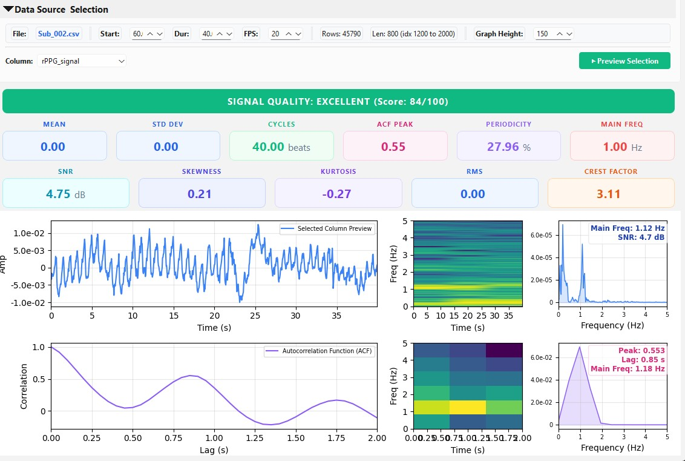
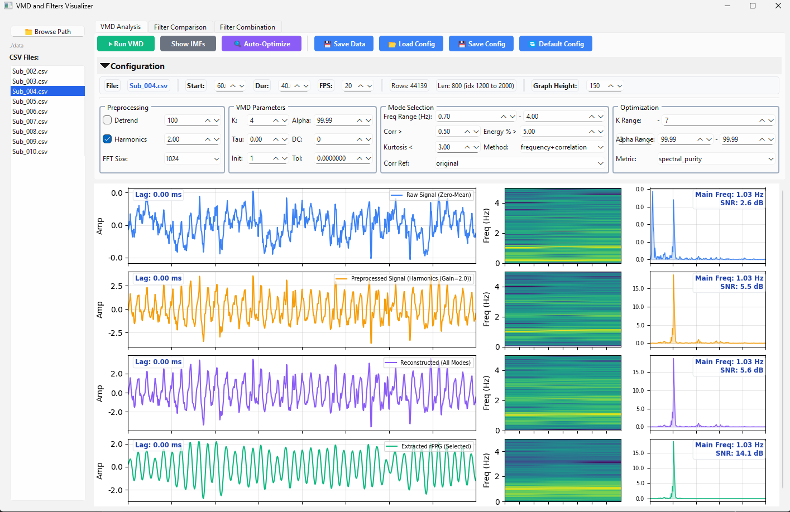
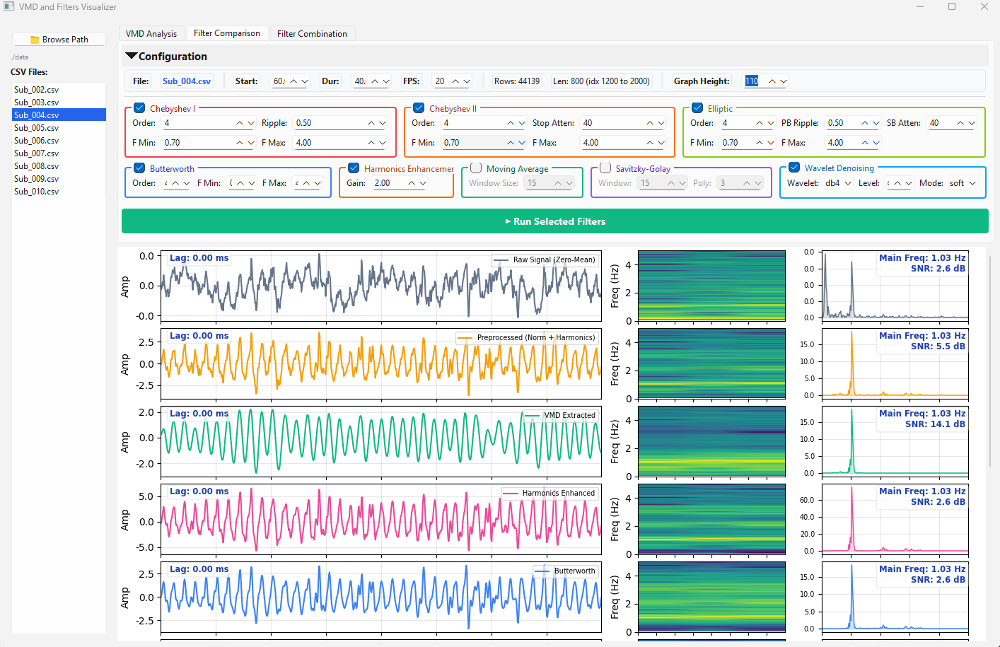
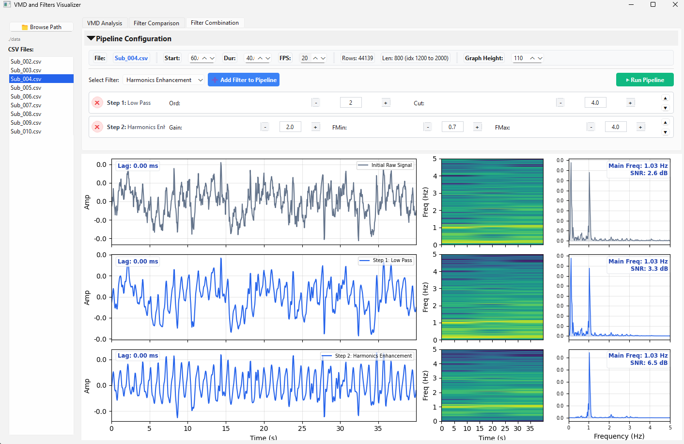

# VMD Signal Processor

A toolbox for Variational Mode Decomposition (VMD) and Signal Processing for biosignal extraction and analysis. This software was originally developed and tested for **remote Photoplethysmography (rPPG)**, but it can be adapted for other physiological signals such as ECG or EEG.

## 📸 Overview

### 1. Data Import & Exploration

The first step is to load your CSV data and select the signal column. This tab performs an automated **Signal Quality Assessment**, providing 11+ metrics (SNR, Skewness, Kurtosis, Periodicity) and a 100-point quality score to help you decide if the signal is suitable for advanced processing.

### 2. VMD Analysis & Optimization

The core engine uses Variational Mode Decomposition to extract physiological signals from noise. It includes an optimization engine to help find suitable decomposition parameters ($K$ and $\alpha$).

### 3. Filter Comparison

Compare different traditional filtering techniques (Butterworth, Chebyshev, Elliptic, Wavelet, etc.) side-by-side to see how they perform on your data.

### 4. Sequential Filter Pipeline

Build filtering chains where filters are applied one after another. You can visualize the signal after every step in the process.

---

## 🧠 VMD for Non-Stationary Biosignals

Biosignals (like rPPG or ECG) are inherently **non-stationary**—their statistical properties, such as mean and frequency content, change over time due to physiological variations, motion artifacts, or environmental noise.

### Why use VMD?
*   **Adaptive Decomposition:** Unlike traditional Wavelets or Fourier transforms that use fixed basis functions, VMD is data-driven. It decomposes a signal into discrete modes (IMFs) that follow the intrinsic oscillations of the data.
*   **Handling Frequency Shifts:** VMD can handle signals where frequencies shift over time (e.g., heart rate variability), which helps avoid the "blurring" effect often seen with static bandpass filters.
*   **Noise Isolation:** By adjusting the bandwidth constraint ($\alpha$), VMD can isolate narrow-band physiological pulses from broadband noise and interference more effectively than many classical filters.
*   **Reduced Mode Mixing:** The variational framework helps ensure that different components (like heart rate vs. breathing) are separated cleanly.

---

## 🚀 Features

### VMD Implementation
- **Decomposition:** Decomposes signals into discrete band-limited modes.
- **Selection Criteria:** Select modes based on frequency, correlation, energy, or kurtosis.
- **Harmonics:** Optionally detect and include harmonics to help improve the resulting signal.

### Parameter Optimization
Finding the right $K$ (number of modes) and $\alpha$ (bandwidth constraint) is important for VMD. This tool provides:
- **Grid Search & Differential Evolution:** Automated iteration through parameter ranges.
- **Metrics:** Optimize based on SNR, Spectral Purity (entropy), or a Combined Score.

### Filter Toolbox
- **IIR Filters:** Butterworth (BP, HP, LP), Chebyshev I & II, Elliptic, and Notch.
- **Smoothing:** Moving Average and Savitzky-Golay.
- **Denoising:** Wavelet Denoising and Harmonic Enhancement.

### Signal Quality & Diagnostics
- **Automated Score**: A 100-point Signal Quality Score (Excellent, Good, Fair, Poor).
- **Expert Metrics**: SNR, Skewness, Kurtosis, RMS, and Crest Factor.
- **Periodicity**: Autocorrelation (ACF) analysis and cycle detection to estimate pulse heart rate.

### Visualization
Each analysis stage shows three synchronized views:
1. **Time-Domain Signal:** Includes calculated metrics like HR and SNR.
2. **Spectrogram:** Shows how the signal's frequency content changes over time.
3. **Power Spectral Density (PSD):** Used to identify peaks and harmonics.

### Data & Configuration
- **Sample Data:** Includes a few rPPG samples (in the `/data` folder) to test the software. These signals are sampled at **20Hz**.
- **Settings Persistence:** UI states and filter settings are saved automatically.
- **Export:** Save results as images or export signal data as `.csv` files.

---

## 💻 System Requirements
- **OS:** Tested on **Windows 11 (64-bits)**.
- **Python:** Compatible with Python 3.8+.

## 🛠 Installation

1. Clone the repository:
   ```bash
   git clone https://github.com/your-username/vmd-signal-processor.git
   cd vmd-signal-processor
   ```

2. Install dependencies:
   ```bash
   pip install -r requirements.txt
   ```

3. Run the application:
   ```bash
   python main.py
   ```

## 📜 License

This project is licensed under the MIT License - see the [LICENSE](LICENSE) file for details.

---

Developed for physiological signal analysis.
